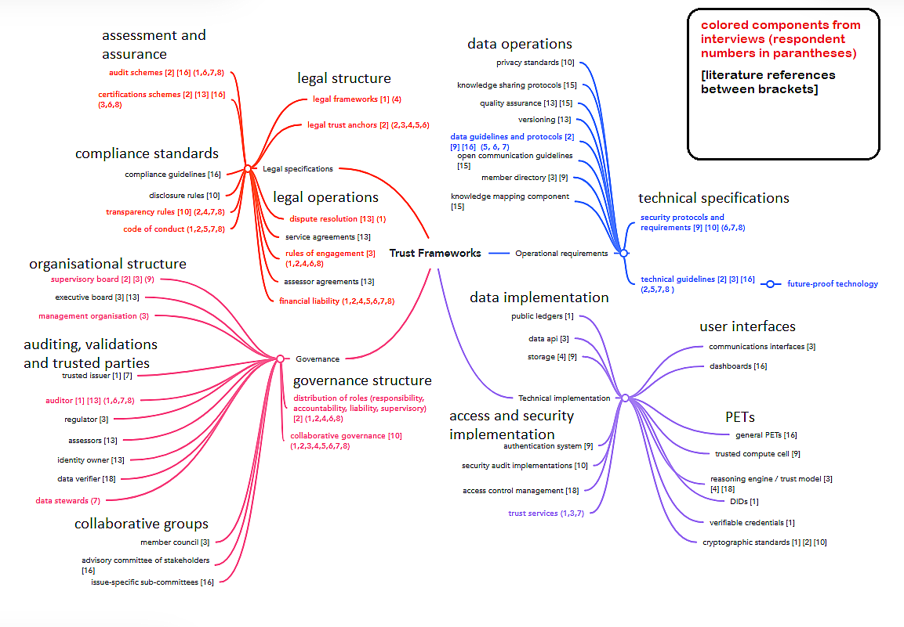
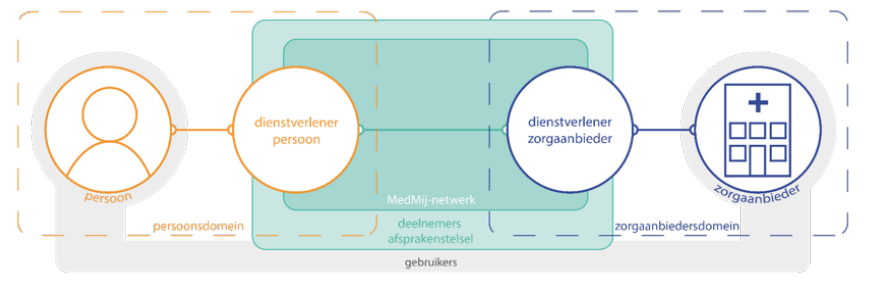
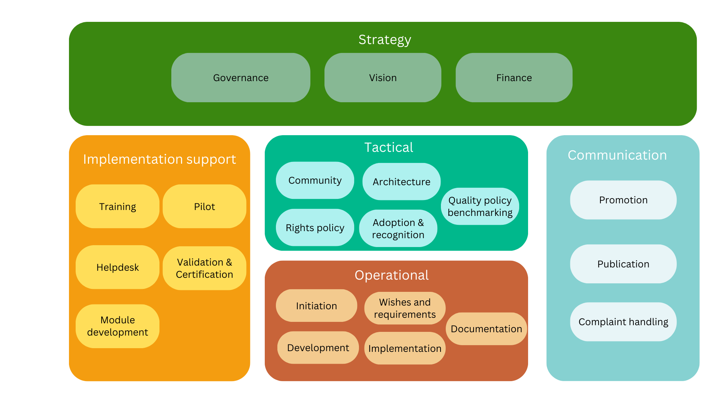

# Structure of BOMOS for the Management of Trust Frameworks

## What are Trust Frameworks?
Defining precisely what constitutes a “trust framework” proves elusive.Notable examples of such frameworks in the Netherlands include eHerkenning, MedMij, KIK-V, and Standard Business Reporting.

A review of the literature [(see understanding trust frameworks)](https://digicampus.tech/wp-content/uploads/2024/09/van-der-Peet-L.-Bharosa-N.-Dijkhuis-S.-Janssen-M.-2024-Understanding-trust-frameworks.pdf) reveals that only a single paper offers a formal definition, originating from the National Institute of Standards and Technology (NIST): a trust framework is “a legally enforceable set of specifications, rules, and agreements governing a multilateral system, established for a common purpose, designed for specific transactions within a community of participants, and bound by common requirements”.

A more pragmatic interpretation frames a trust framework as close forms of collaboration among stakeholders from business, government, and academia, who provide products or services in accordance with agreed-upon standards.

## Relationship Between GovTech and Trust Frameworks
GovTech initiatives focus on leveraging technology to enhance the public sector and address societal challenges. These efforts frequently arise from collaborations between government, industry, and knowledge institutions, with technological innovation at their core. After all, the government does not always possess the capacity or expertise to independently respond to technological developments.

The development of GovTech initiatives is closely intertwined with the emergence of trust frameworks as a **governance mechanism** for digital public infrastructure. These frameworks constitute an essential component of the government's digital transformation.

## Contents of a Trust Framework
The core of a trust framework consists of the rules of play that every supplier or other stakeholder must comply to before taking part in order to provide a service.
These rules, on the one hand, guarantee for the user that products or services can be obtained safely and reliably; on the other hand, they are mutual agreements that underpin successful cooperation.

Elinor Ostrom, in her book *Governing the Commons*, describes the conditions for successful collaboration around scarce common resources, such as the management of water wells. These principles can be recognised in the operation of successful trust frameworks. They are (loosely translated):
-	Commons need to have clearly defined boundaries in terms of shared functionality/resources and a homogeneous user group.
-	Harmony and balance in benefits and costs for all stakeholders.
-	Everyone can contribute to improvements.
-	Monitoring of all stakeholders (based on transparency).
-	Graduated sanctions on violation of agreements are in place and implemented.
-	Differences of opinion can be quickly and effectively solved.
-	Participants in the framework have the right to self-governance.
-	Use systems of frameworks to keep individual frameworks simple.

These principles are the foundation of agreements and rules governing the following aspects that recur as elements of a trust framework:
-	Information about rights and obligations of the stakeholders: such as definitions, liability, governing bodies, management and distribution of tasks.
-	Financial: the management of a trust framework and organising its management cost money: what agreements have been reached on who pays for what?
-	Operational: who solves incidents? Are operations carried out subject to a label or brand? Take for example communication, brand management and agreements on operational processes.
-	Frameworks of standards: what requirements must suppliers products/services meet?
-	Architecture and technical aspects: for example technical standards, use cases and interface descriptions.

This component diagram was developed by and based on the research of L. van der Peet and provides insight into the relevant components of a trust framework.

### Example of a Trust Framework: Medmij

The Medmij trust framework (for more info: see [Medmij](https://medmij.nl/en/medmij-framework/)) makes it possible for end users to securely and reliably share health-related information in their personal health environment with care providers such as a dispensing chemist or hospital. The end users select a party to supply the health environment and hospitals select a party they connect to the Medmij network. The trust framework provides the conditions for secure and reliable exchange and the technical facilities for practical operation. The scope of the trust framework is the area in which the service provider of the end user cooperates with the service provider and the care provider. There are multiple service providers on both sides and thanks to the framework, the complexity is restricted and the services and products work well together.  

This layout is also known as the ‘four corner’ model. In this case, via their own broker, end users are connected to other participants in the framework. Remember: there are also other possible configurations within a trust framework, such as a central facility (3-corner) or an additional branch for example for transaction-driven accounting information (5-corner).

## How can BOMOS be deployed as Best Practice for the Management of Trust Frameworks?
Trust frameworks cannot existing without standards... Standards are the foundation on which interoperability and cooperation are made possible. It appears to be a combination of standards with one important addition: in the case of a framework, agreements are also reached on operational aspects of cooperation for the supply of a product or service.

To a considerable extent, the management of a trust framework and of a standard are closely intertwined, making BOMOS ideally applicable in this broader scope. The BOMOS activities are also clearly recognisable and usable within frameworks, with the occasional exception or deviation. As with the management of a standard, in trust frameworks there are activities aimed at organising the operation, further development and management of central provisions, support for connecting to the framework and promoting use.

Logius has developed a tool to conduct a BOMOS assessment specifically aimed at trust frameworks. This assessment can be applied in several ways. When establishing a new framework, readers can quickly explore which components are most important to set up first. For an existing trust framework, the assessment is valuable for identifying, together with stakeholders, which components require additional attention. This tool is available (in English) online; see [BOMOS assessment](https://regelhulpenvoorbedrijven.nl/bomos-assessment-tool-en/).

Experience has now been acquired in practice with the implementation of this specific BOMOS assessment for trust frameworks. These analyses clearly reveal the value of having a trust framework to provide structure, definitions, activities and tips and tricks. BOMOS supplies the common language and promotes understanding of each other’s roles and perceptions, thereby enabling constructive discussions.

The result of any assessment helps in the short term to arrive at a target for professionalising management, as well as identifying the steps that need to be taken in that process. If you conduct an assessment together with the stakeholders, you automatically generate the support you need to put the changes into effect.

The BOMOS foundation can be ideally used for structuring the management of new trust frameworks. In that situation, BOMOS helps to create a clear picture for a programme or for a client of the activities that need to be organised, and why. This picture then helps in setting the priorities for organising management activities and estimating the necessary resources.

## BOMOS applied to Trust Frameworks

### Strategy

#### Governance

It is essential to reach structured agreements between the various stakeholders in a trust framework. These harmonised agreements are reached via the governance of the framework. This requires the description of the organisation structure, and forums for decision making and roles.
The organisation structure clarifies the forums that exist in the framework of decision making and the types of decisions that are taken in each forum. The structure also clarifies how tasks, relationships and communication between the groups are safeguarded. This does however essentially require a distinction between a governing body and execution.

Agreements on how decisions are taken, how to become a member of a decision-making forum and the scope of governance can be elements of the trust framework itself, but can also be outside the trust framework, in the form of an institutional decision or covenant.

The role of watchdog is an additional role over and above the roles within standards: what organisation has been put in place to assess whether agreements are actually complied with, and what are the procedures and means of intervening if this is not the case. It is important that this task be occupied independently to avoid a situation in which the fox is set to guard the henhouse. This role is also responsible for taking appropriate measures in the case of non-compliance.

#### Vision
The aim of any trust framework must be clear and concise. At its heart, the mission of any framework is the ‘wish to solve’ a problem that is too complex and too large to be solved independently and which requires the assistance of other organisations. These organisations join forces to arrive at the solution and to reach agreements on the approach to be followed. This is expressed in a positive business case. This mission and vision are reflected in the communication released by a trust framework and create a bond between the parties active within the framework.

#### Funding
For those parties wishing to play an active role within a framework, it must be financially attractive as reflected in a positive business case if the framework is to have a future. This applies to private, public-private and public frameworks. The same business case is required to account for the fact that a management organisation needs to be established and funded over a longer period. The management organisation can be financed by the stakeholders, members of the framework or centrally, by the owner.

Roadmapping (additional activity)
Making and maintaining a multiyear roadmap brings together the strategic choices and the steps to be followed in arriving at the objective. It helps with adoption because the stakeholders know when specific functionalities will be delivered, which makes it attractive to use the products of the frameworks or to fulfil a role within the framework. Elaborating and upholding a common goal in the form of a roadmap also generates support. It describes the concrete steps that must be taken to bring about the vision.

### Tactical

#### Community
Within a trust framework, the term community is less commonplace but there are organisation forms that operate at tactical level, but more in the form of an expert group or working group. These groups are involved in substantive changes to a trust framework and in drawing up recommendations on innovations and architecture. The governance of a framework issues instructions to establish an expert group or working group, with a clear assignment.

The composition of the working group will depend on the nature of the assignment. There are working groups that consist only of representatives of suppliers, but others are a combination of users and other stakeholders.

#### Adoption and Recognition
To be active in the government domain, it is useful to have a formal status for the framework, in other words an obligation or recommendation to make use of the products of the framework. Another key factor is the development of critical mass in terms of use. This is often a chicken and egg problem in which many parties wait to see who will take the first steps, before themselves joining in after large implementing organisations for example make the switch. To ensure that these developments are well organised requires a strategy with support from the stakeholders.  This in turn increases the likelihood that suppliers will be able to draw up a positive business case and that new participants will join in. Governance is responsible for adoption.

### Architecture
Architecture can be viewed in different ways or from different viewpoints (see Archimate): from the point of view of strategy, business, the applications or the underlying components. This variety of viewpoints often relates to the different roles the parties play within a a trust framework. In the ideal world, all those roles are described but in practice there are often differences in the level of elaboration in different frameworks. Having access to these models makes it easier to communicate together and to effectively estimate the impact and opportunities offered by changes. It also lowers the threshold for new parties wishing to become part of the trust framework.

Interoperability also plays an important role within a trust framework, as reflected in the attention paid to the architecture of the technical interfaces between the various stakeholders.  Architecture also refers to the choices about which (technical) standards should be used within a trust framework, by the various participants.

Operating and jointly defining the architectural principles for a trust framework (see NORA) is a valuable tool when it comes to assessing proposals for change.

#### Trust Framework Risk Analysis (additional activity)
A trust framework is the foundation that enables secure and reliable data exchange between different parties. It is also essential for the governance to have a clear picture of the situation with regard to threats and risks to the framework itself. What could go wrong, what should I do to avoid potential risks, and if a threat does become reality: what steps should I take and who should I reach out to?

### Operational

#### Wishes & Requirements
Just like a standard, a trust framework also develops by meeting the wishes and requirements of users. This is yet another key element of changes that make a structural contribution to the business case, legislation and regulations and measures for facing up to (future) threats to security and reliability.  To manage all these aspects successfully, a trust framework contains rules on how changes must be initiated, descriptions of the decision-making process and how those changes are integrated in the trust framework and eventually implemented by the stakeholders. One key aspect in the implementation of changes in a trust framework is safeguarding continuity: ideally, you avoid scenarios in which changes are rolled out via a big bang approach; instead they are rolled out at their own pace. This can be organised by facilitating some form of backwards compatibility.

#### Documentation
The trust framework is freely available and accessible. This prevents the outside world viewing with suspicion what goes on within a trust framework as if it were a cartel. In the ideal world, the documents used are also publicly available. Transparency helps in generating support.  

#### Operational Handbook (additional activity)
To a considerable extent, a trust framework consists of agreements on mutual cooperation. This deals with such issues as how you respond to wishes and requirements about the change process and how you can join, how disruptions and incidents are reported and corrected, the service windows of the various stakeholders and the reporting requirements to each other and to the governance.

### Implementation Support
The extent to which implementation support is provided by the trust framework depends on the distribution of tasks between the participants within the framework and the framework governance organisation. It is logical, for example, that a party that enters into a contract with a supplier calls upon that same supplier for support in implementation (connection) and use. Within the framework itself, the management organisation is tasked with playing a role in issues relating to the interpretation of the framework specifications and for example connecting to the network.

#### Validation & Certification
There are trust frameworks that provide validation tooling to support participants in testing their implementation. It is essential that the suppliers be involved in the realisation and assessment of these tools to avoid inconsistencies and uncertainties in the specifications only emerging at a late stage (during actual realisation).

With regard to the inspection and certification, these are normally the task of the party that fulfils the role of watchdog. The watchdog observes to determine whether the agreed framework of standards has been correctly implemented by the supplier. There are clear agreements on when the supplier should actively inform the watchdog to carry out an assessment. For example changes to processes that relate closely to the framework of standards.

### Communication

#### Promotion
The advantages offered by a product or service from a trust framework must be made clear to the broadest possible public. Operating a common brand or label can be useful in promoting the recognisability of the service. The trust framework contains  rules on drawing up generic expressions, brand management, what the management organisation should do and how much leeway suppliers are allowed. The suppliers are responsible for their own marketing and activities to expand their own market but are subject to the rules of the trust framework.  The management organisation has a role in promoting the benefits of the framework but not of the individual services or products of the suppliers that make up the framework.

#### Publication
This includes maintaining a site that provides information about the trust framework, the use of social media and the sharing of information with specific user groups.

#### Complaint Handling
As well as submitting a complaint to their own supplier, users may also feel the need to report their complaint to an independent party. A complaints committee can issue a binding judgement in situations where the two parties fail to arrive at an agreement.
